# 🚀 Lab 1: Setup and configure 

## Lab 1 - Tasks

In this lab, you will go though the following tasks:

- Creating a new browser profile
- Logging into the account you are going to use during the workshop
- Creating a GitHub account (optional)
- Fork a GitHub repository
- Creating a GitHub codespace
- Connecting to the Power Platform using the Power Platform Command-Line Interface (CLI)
- Creating developer environments
- Enabling Dataverse settings
- Installing the Creator Kit

## Task 1: Create a new browser profile (Microsoft Edge)

It's always good to have a separate browser profile for your work and for workshops like this. This way you can keep all of your credentials separate and not have to worry about logging out of your personal / work accounts.

1. Open Microsoft Edge
2. Click on the profile icon on the top left corner
3. Hover over "Other Microsoft Edge Browsers" / "Other profiles" and then select **Add Browser** / **Add profile**

    

4. Click **Add**

    

    This will then open up a new browser window on your taskbar.

5. Pin that browser window to your taskbar
6. In the new browser window, select **Start without your data**

    

7. Then select **Confirm and start browsing**.

    

    It may prompt you to configure your new browser theme. If this happens, just select **Next** and then **Finish**.

## Task 2: Log on to your account

With the credentials that were provided to you, let's log into the account you are going to use during the workshop.

1. Go to [make.powerapps.com](https://make.powerapps.com)
2. On the sign-in screen, enter the email address that was provided to you and then click **Next**

    

3. Then enter the password and click **Sign in**
    
    

4. If you're prompted to stay signed in, click **Yes**

    You should now be logged in and on the Power Apps Home Page.

    

## Task 3: Create developer environments

Developer environments are very helpful when you want to try out features, they are meant to be short living environments.

For this workshop, we are going to create three different developer environments:

* ```Dev```: The environment where we are going to import our solution later on.
* ```Test```: The environment where we are going to deploy our solution to in lab four.
* ```Prod```: The environment where we are going to deploy our solution to in lab four.

To create developer environments, you can create them in two ways:

1. Via the Power Platform Admin Center
1. Via the Power Platform CLI

In this workshop, we will create the environments through the Power Platform Admin Center.

1. Go to the [Power Platform Admin Center](https://aka.ms/ppac)
2. Exit the Welcome / Tour pop up. You can do this by clicking on the **X** in the top right corner of the pop up screen

    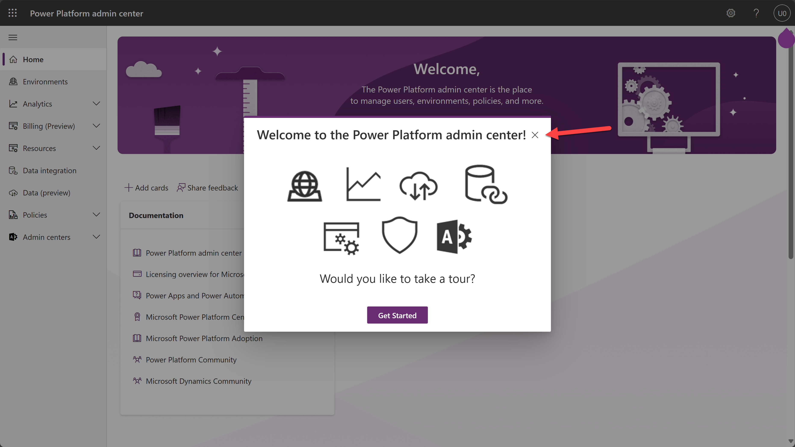

3. Click on **Environments** in the left navigation
4. Click on **New** in the top navigation

    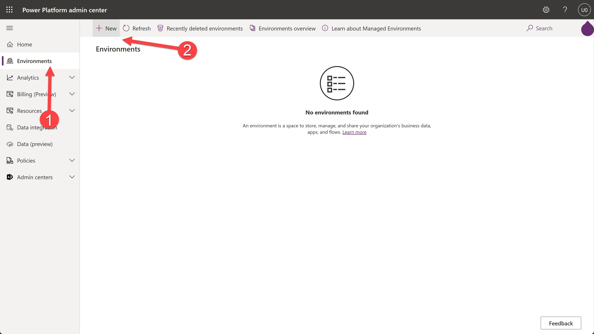

5. When the right-hand side dialog pops up - enter the following information:

    | Field | Value |
    | --- | --- |
    | Name | Dev |
    | Region | Europe - Default |
    | Type | Developer |
    | Purpose | Developer environment for EPPC23 |

    

6. Click **Next**
7. The next section is asking you to add Dataverse. Finally Click on **Save**
8. Now do the same for the Test and Prod environments with the following information:

   ```Test Environment:```

    | Field | Value |
    | --- | --- |
    | Name | Test |
    | Region | Europe - Default |
    | Type | Developer |
    | Purpose | Developer environment for EPPC23 |

    ```Prod Environment:```
        
    | Field | Value |
    | --- | --- |
    | Name | Prod |
    | Region | Europe - Default |
    | Type | Developer |
    | Purpose | Developer environment for EPPC23 |

9. Once you have created all three environments, you should see them in the list of environments. Click the **Refresh** button on the top navigation if you don't see them yet.

    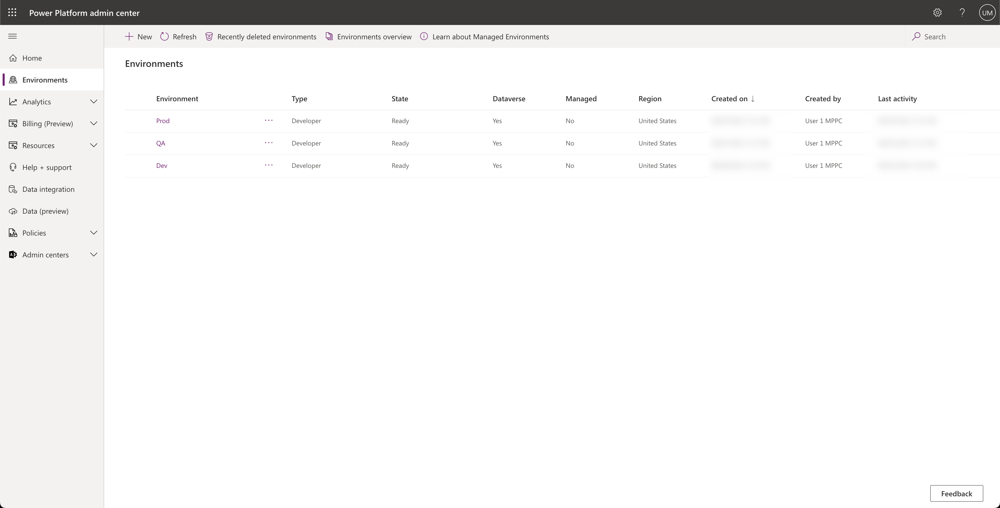

## Task 4: Install the Creator Kit

The solution that we will be working with in this workshop relies on the Creator Kit as a dependency. The Creator Kit is a set of components based on Fluent UI which you can use in Canvas Apps.

The Creator Kit is not available out of the box, so we will need to install it in the ```Dev``` environment.

1. With the Power Platform Admin Center still open, click on the **Dev** environment to open it

    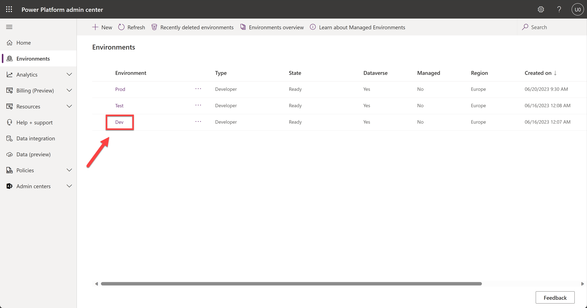

2. Select **Resources** from the top navigation bar and then select **Dynamics 365 apps**

    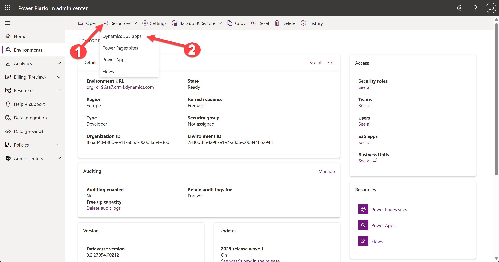

3. Click on the **Install app** button on the top navigation bar

    

4. On the right-hand side popup screen, select the **Creator Kit** and then click **Next**

    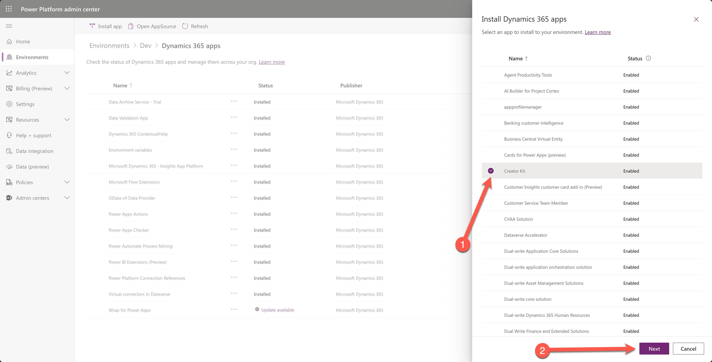

5. Select the **I agree to the terms of service** checkbox and then click **Install**

    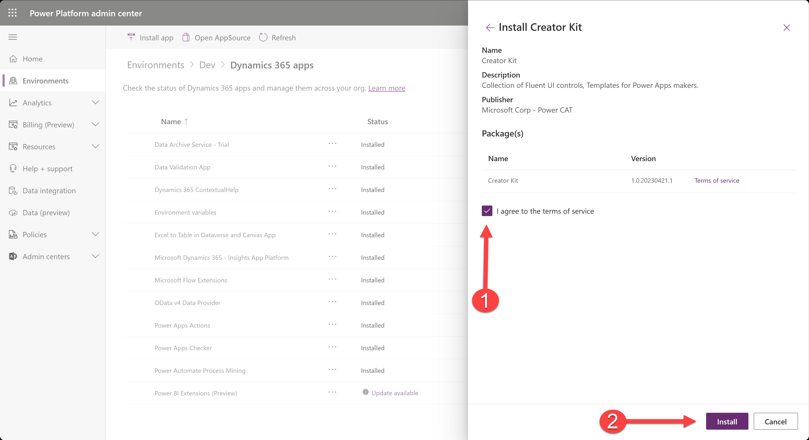

    This process may take a couple of minutes, you can refresh the page by selecting the **Refresh** button in the command bar at the top.

    Once the installation is complete, you should see the Creator Kit in the list of apps with the Installed Status.

    

## Task 5: Create a GitHub account

For this workshop, we are going to be using GitHub. If you already have a GitHub account, you can skip this task.

1. Go to the [GitHub](https://github.com) website
2. Click on **Sign up** on the top right corner
3. Enter your email address (Use your personal email address) and then click **Continue**
4. Create a password and then click **Continue**
5. Enter a username and then click **Continue**
6. Select whether you want to receive product updates or not and then click **Continue**
7. Solve the puzzle to verify your account and then click **Create account**
8. Enter the code that was sent to your email address and then when you've navigated to the welcome screen, click **Skip personalization**

You now have a GitHub account. Welcome to the community!

## Task 6: Create a fork of the repository for this workshop

Now that you have a GitHub account, we are going to create a fork of the repository for this workshop. A fork is a copy of an existing repository. Forking a repository allows you to freely experiment with changes without affecting the original project.

1. Go to the [EPPC23-ALM](https://aka.ms/EPPC23-ALM) GitHub repository
2. Click on the **Fork** button on the top right corner

    

3. Once the "Create a new fork" page opens, review the information and then click **Create Fork**

    

    Once your have created the fork, you will be redirected to your forked repository. You can see that you are in your forked repository by looking at the top left corner of the page. It should say **your-username/EPPC23-ALM forked from microsoft/EPPC23-ALM**.

## Task 7: Create a codespace

A codespace is a cloud-hosted development environment you can access from anywhere. It has everything you need, including a text editor, terminal, and debugger. Codespaces are powered by Visual Studio Code and run in a containerized environment. For this workshop, we are going to use codespaces to do our development.

1. Make sure that you are in your forked repository (_your-username/EPPC23-ALM_) and then find and click on the **<> Code** button

    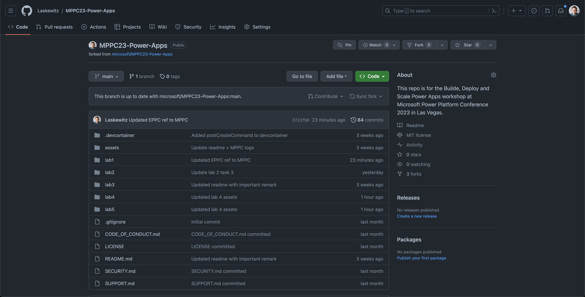


2. On the **Code** pop up, select the **Codespaces** tab
3. Click **Create codespace on main**

    A codespace will now be created for you in a new tab. This will take a few seconds. But once it's done, you will have a fully functional Visual Studio Code environment in your browser. You can now start developing!

## Task 8: Install the Power Platform Tools extension

The Power Platform Tools extension is a Visual Studio Code extension that allows you to interact with the Power Platform from within Visual Studio Code. It is a very important component of the ALM story for the Power Platform and for this workshop.

1. In your codespace, click on the **Extensions** icon in the left navigation

    

2. Search for **Power Platform Tools** and then click **Install** on the **Power Platform Tools** extension

    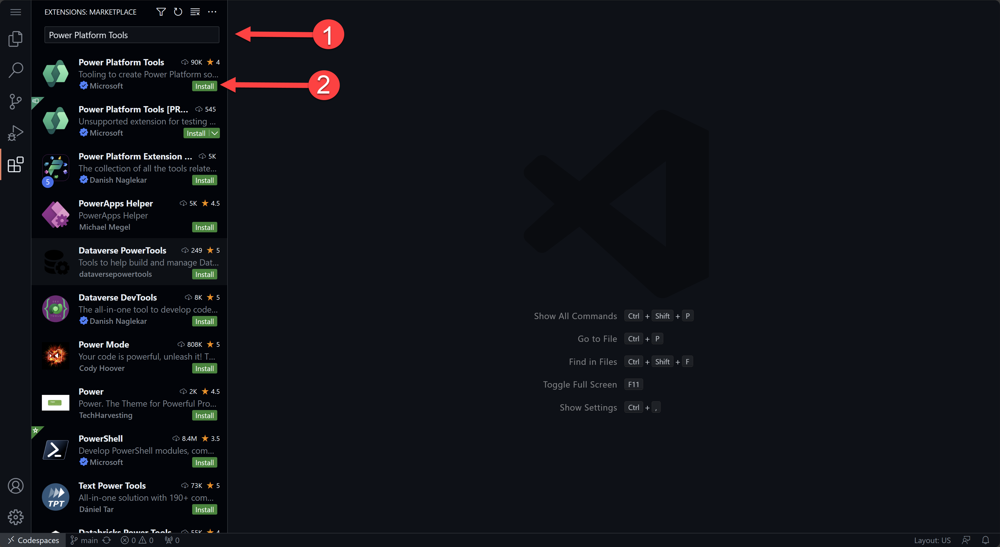

    After installing the **Power Platform Tools** extension, you will be prompted to "Select File Icon Theme". Select any of the 2 options.

    With the Power Platform Tools extension installed, you can now interact with the Power Platform from within Visual Studio Code. But before we can do that, we need to connect to a Power Platform environment.

## Task 9: Connect to the Power Platform environment
    
1. In your codespace, click on the **Power Platform** icon in the left navigation

    

    You'll more than likely see that there is "No auth profiles found on this computer". Let's create one.

    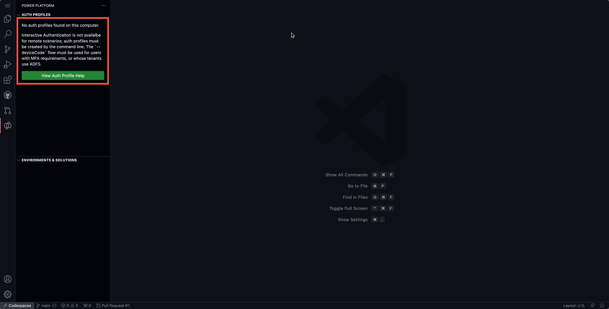

2. If you don't see it open already, let's open the Terminal. Click on the Burger menu icon in the top left corner and then hover over **Terminal** and then click **New Terminal**

    

    A terminal window has now been opened for you. This is where you will write all of the following commands in this lab and in the upcoming labs as well.

3. Type the following command in the terminal and then press **Enter**:

    ```bash
    pac auth create --deviceCode
    ```

4. You will be prompted to use a web browser to authenticate. Copy (**ctrl + c**) the ```code``` that is provided in the terminal and then **Ctrl + click** on the ```link``` that is provided in the terminal. 

    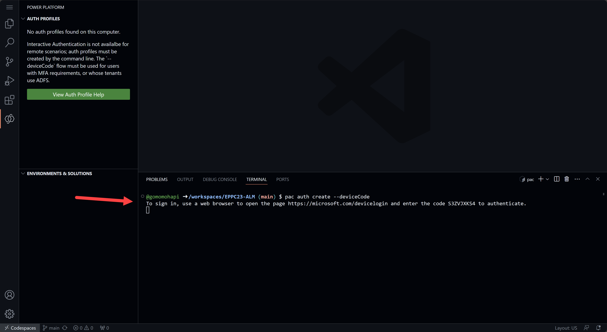

    Once you click on that link, it will open a new browser tab where you will have to paste that code into the browser and then click **Next**    

    > **Note:** If you are using a Mac, you can **Ctrl + click** on the ```link``` that is provided in the terminal and then enter the ``code`` provided.

    

5. Pick the account that was provided to you. If you can't see it on screen then log in.

    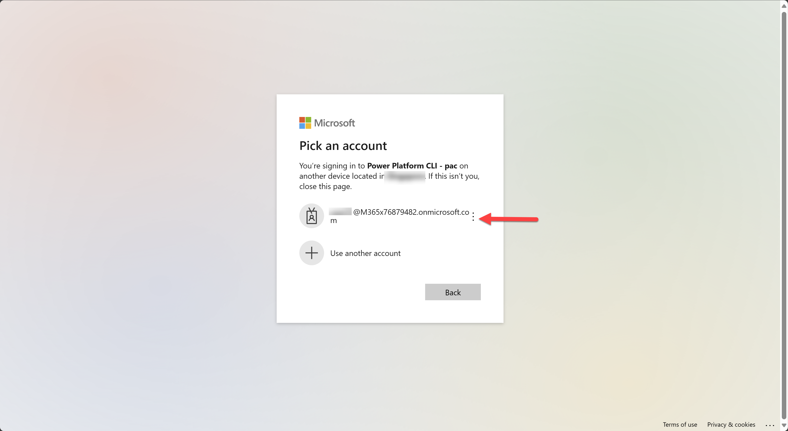

6. Then type in your password and click **Sign in**

    You will then see a page asking if you're trying to sign in to Power Platform CLI - pac. 

    

7. Click **Continue**

    You'll then see a prompt confirming that you have successfully signed in to Power Platform CLI - pac. Close the browser tab and return to your codespace.

8. Refresh the Auth Profiles section by clicking on the **Refresh** button next to "Auth Profiles"

    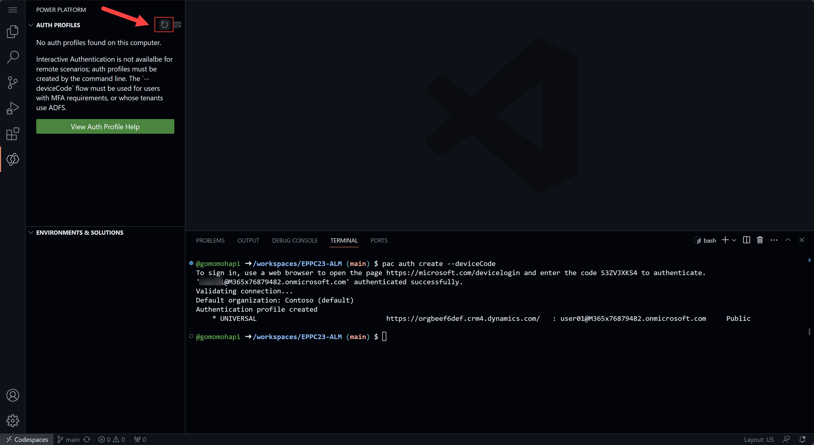

    You should now see at least one auth profile. If you have more than one, you can select the one you want to use by clicking on the **Select Auth Profile** button next to the auth profile.

    

9. With the correct Auth Profile, in the terminal type the following command and then press **Enter**:

    ```bash
    pac org list
    ```

    This gets a list of all the environments that you have access to. You should see the **Dev** environment listed as one of them. This is the one we want to eventually connect to. 

    

10. Take note of the Environment ID of the **Dev** Environment and copy it. 

    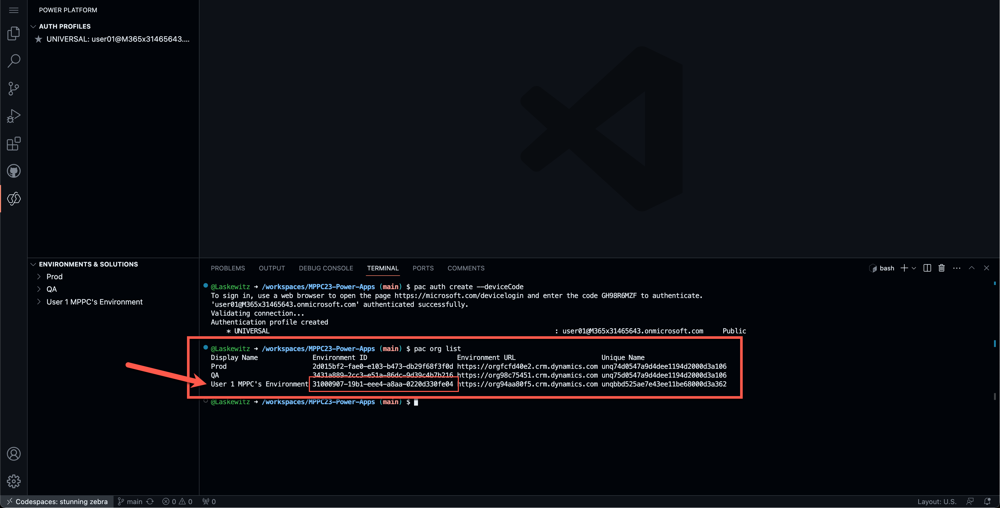

11. Then in the terminal, type the following command and then press **Enter**. Make sure to replace ```00000000-0000-0000-0000-000000000000``` with the environment id that you copied above

    ```bash
    pac org select --environment 00000000-0000-0000-0000-000000000000
    ```

    You should then see confirmation that you have successfully selected the **Dev** org for the current auth profile.

    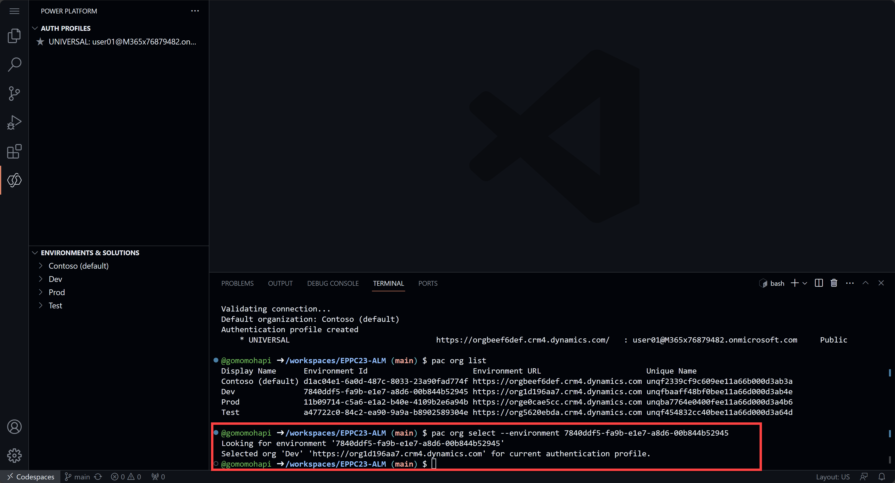

12. To have further confirmation that you have successfully connected to the **Dev** environment, in the terminal type the following command and then press **Enter**:

    ```bash
    pac org who
    ```
    This command will return information about the environment that you are connected to. You should see the **Dev** environment listed as well as other unique information about the environment including the User email you're connected as.

    

## Next lab

This is the end of lab 1, select the link below to move to the next lab.

[⏭️ Move to lab 2](../lab2/README.md)