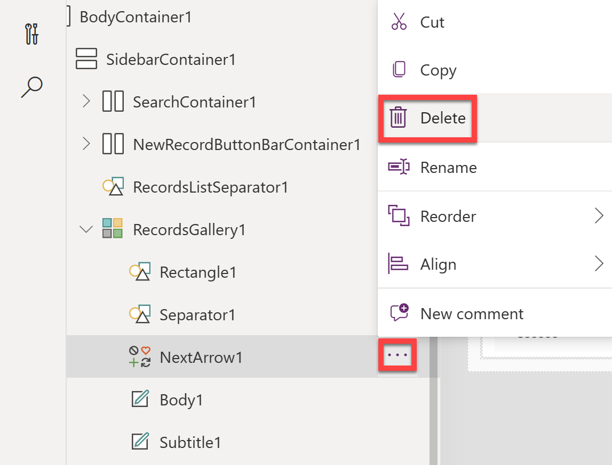
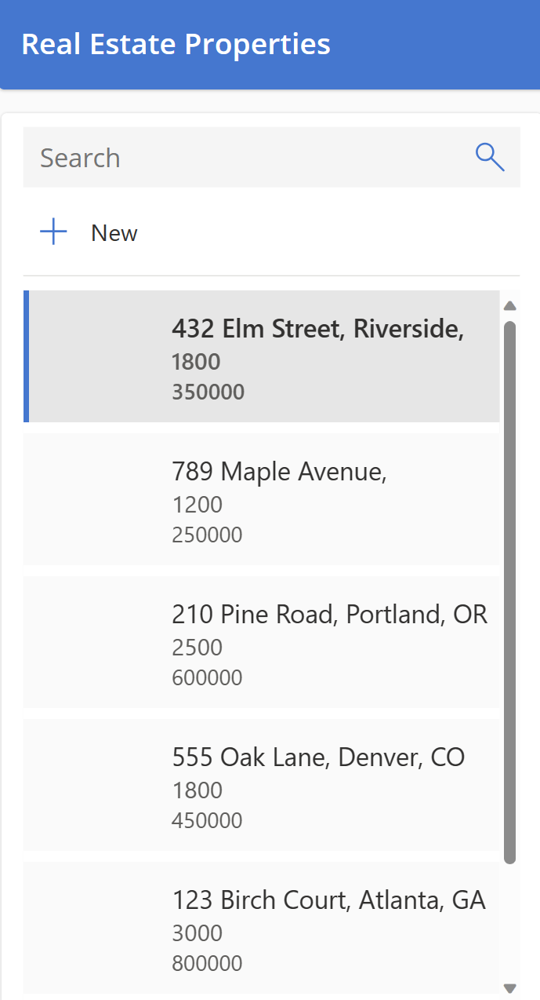
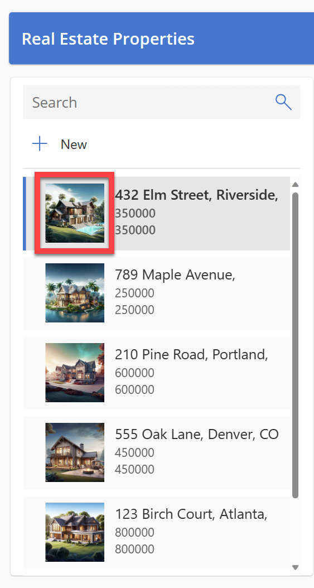
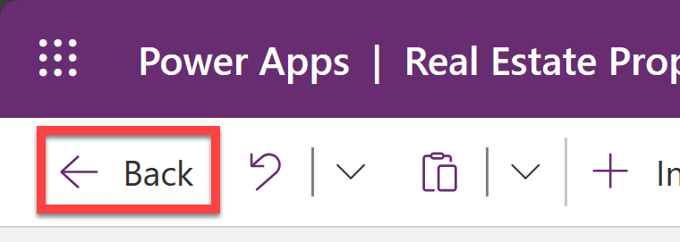

# 🚀 Lab 2: Develop

> [!IMPORTANT]
> This workshop is still work in progress for the time being.

## 📝 Lab 2 - Tasks

In this lab, you will go though the following tasks:

- Creating A Canvas App With Data From An Excel-File
- Creating A Canvas App With Power Apps Copilot
- Creating A Reminder Workflow With Power Automate Copilot
- Creating A Solution
- Add The Resources Created By Power Apps Copilot To A Solution

## ☑️ Task 1: Create A Canvas App With Data From An Excel-File

With Excel to App, you'll select an Excel file, create an app, and then run the app that you create. Every app created includes screens to browse records, show record details, and create or update records. By generating an app, you can quickly get a working app using Excel data, and then you can customize the app to better suit your needs.

When you upload an Excel file it generates a Dataverse table. With Dataverse's standard and custom tables, you can securely store your data in the cloud. These tables enable you to define your organization's data in a way that is tailored to your business needs, making it easier to use within your apps.

If your environment is in the US region and AI is enabled in your organization, the AI Copilot feature can assist in table creation by suggesting table names, descriptions, column data types, and headers, even if this information is missing from the uploaded file. When Copilot AI is used for table creation, the Copilot card is displayed to indicate that the table was generated by Copilot AI.

In this task, you’ll create an application with data from an Excel table.

> **Note:**
>
> Power Apps requires either a Microsoft 365 license or a free trial. Learn more about your licensing options. [Microsoft products include Microsoft Power Apps and Power Automate](https://learn.microsoft.com/power-platform/admin/pricing-billing-skus).

### Explore The Excel To Power App Functionality

1. Go to [make.powerapps.com](https://make.powerapps.com/) and Sign In with your Power Apps credentials.

2. From the Power Apps home screen, select Start with data.

    

3. Then select Upload an Excel file.

    

4. Click Select from device and navigate to the location where the RealEstateProperties.xlsx Excel file is saved and upload it. The maximum file size limit is 5 GB.

    

5. A table which is based on the data from the RealEstateProperties.xlsx Excel file will be generated. Click the pencil edit icon next to the table name to change it.

    

6. On the Edit Table pop up, enter Real Estate Property as the Display name, Real Estate Properties as the Plural Name, and make sure that Address is selected as the Primary column. Select Save.

    

7. Select the Create app button on the bottom right-hand corner of the screen.

    

8. When the app first loads, a dialog may appear saying: Welcome to Power Apps Studio. If so, select the Skip button.

9. You should now be viewing the app that has been generated for you in Edit mode.

    

10. To the left of the screen, select the Data icon from the navigation bar. Notice that a Dataverse table, based on the RealEstateProperties.xlsx Excel file, has been created.

    

11. Select the Tree view icon to return to the Tree view.

    

12. On the app main screen, click on the gallery displaying the Real Estate Properties and then click on RecordsGallery1 in the Tree view to expand it.

    

13. Select the ellipsis (…) next to the NextArrow and delete it.

    

14. Select the RecordsGallery1 and then select the edit button to put the gallery in edit mode.

    

15. Reduce the width and move the position of the Title component so that it is towards the right-hand side of the template cell.

    

    The other components should reposition alongside the Title component. If not, then move them until it looks like the screenshot above.

16. Make sure that the gallery is still in edit mode. Select the Title.

17. Make sure that the Text value of the Title component is set to the following formula:

    `ThisItem.Address`

    

18. Now select the Subtitle component in the gallery.

19. Set the Text value of the Subtitle to the following formula:

    `ThisItem.Size`

20. Using the tool bar at the top of the page, change the Size to 13.

    

21. Finally, select the Body component in the gallery.

22. Set the Text value of the Body to the following formula:

    `ThisItem.Price`

23. Your gallery should now look like this:

    

24. Select the RecordsGallery1 and then select the edit button to put the gallery in edit mode. Then click on Insert > search for Image > and then select the Image component.

    

25. The image will then be added to your gallery. Reposition and resize the image so that it is in the center of each gallery cell.

    

26. Now to use Power Apps Ideas. Make sure the gallery is still in edit mode. And select the gallery body containing the Price. Then select the **arrow** next to the lightbulb icon which appears above it. Next, select **Text formatting**.

    

27. Enter this output in the Desired format text box:

    `$350,000`

    Then press Enter.

    

28. Select the generated formula. Then select Apply.

    

    With Power Apps Ideas, the example \($350,000\) which you gave generated a formula:

     `(Text(ThisItem.Price, "$#,##0", "en-US"))` which is now updated in the formula bar for the Price gallery control.

29. Now let’s do the same for the Size control in the subtitle of the gallery. Make sure the gallery is in edit mode. And select the subtitle containing the Size. Then select the **arrow** next to the lightbulb icon which appears above it. Next, select **Text formatting**.

30. Enter this output in the Desired format text box:

    `Size: 1,800 sq ft`

    Then press Enter.

    You may notice that the ideas section is empty. This may be caused by the lack of information or context required to generate a formula.

    

31. So, let’s add more examples. Click + Add examples at least 2 more times.

    

32. Select 2 Current formats and then provide 2 corresponding Desired formats.

    

33. With the added context, Power Apps Ideas now generates a suitable formula for you:

    

34. Select the generated formula. Then select Apply.

    Your gallery should now be looking like this:

    

35. Save the app.

36. Exit the app to return to the Power Apps home page.

    

## ☑️ Task 2: Create a Canvas App with Power Apps Copilot

In this task, you’ll create a mobile application leveraging Power Apps Copilot.  This app will be used by field agents to browse real estate inventory and manage appointments for showings and the data will be stored in Dataverse.

Before you begin, watch this video for a brief overview of what to expect when creating your first Power App with Copilot.

> **Note:**
> Power Apps requires either a Microsoft 365 license or a free trial. Learn more about your licensing options. [Microsoft products include Microsoft Power Apps and Power Automate](https://learn.microsoft.com/power-apps/administrator/pricing-billing-skus/).

### Explore AI Copilot within Power Apps

> **Note:**
> Within this lab, notice that your results for data may vary from those within the screenshots and images throughout the lab. This is because Power Apps is using OpenAI to generate data for the lab that changes daily.

1. In the center of the **Home** page within Power Apps, there's a text field in which you can enter a prompt to search for an AI generated table.  
  
1. Within the **text field** type the following prompt:
  
    ```text
    build an app to manage real estate showings
    ```

1. Then, select the **Send** button.

      

1. After the AI Copilot generates a table based on your prompt, look through the table to see what columns have been created for the start of your table.

    

    > **Note:**
    > If you'd like, you can add or modify the existing columns generated within the table by Copilot. But note that there is a pre-built Suggestions section to the left of the screen.

1. Let's explore further within modifying and adding to the already generated table.
1. In the text box, at the bottom of the **Copilot** pane to the right of the screen, type:

    ```text
    Add a column to track client email
    ```

1. Then, select the **Send** button.

    

1. Notice how a new column has been added to the table displaying the client’s email

    

    > **Note:**
    > Remember that the data that is generated in your table may vary from the data shown within the table in the screenshots and images for the lab.

    > **Note:**
    > In the bottom left corner of the screen, notice that there is a section titled Suggestions. This section provides you with different suggestions on how you can add to and modify your table.

    

1. Notice that to the right of the screen, it appears to look as if you're having a conversation with a Copilot AI bot while adding to and modifying your table. Here's where you can scroll through and view the changes or additions you have made to your table.

    

1. Now, let’s edit the **Status** column within the table. In the text box within the **Copilot** pane, type and send:

    ```text
    Add an option for “Completed” to the Status column
    ```

1. It may take a minute to load. Once it does, you should see something like this:

    

1. Select the **Status** column name **drop down**, and select **View column**. Here, you can view the columns’ properties and the current status details and data.

    

1. Select the **X** in the top right corner of the pane to close out.

    Let's try adding more data to our table and the existing columns.

1. Within the **Copilot** pane text box, type and send:

    ```text
    Add 5 more rows of data
    ```

1. Notice that five more rows of data are added for each of the existing columns within the table.

    

1. If you have a property/address column, which has data relating to the physical address of the property, then delete it using the Copilot chat window with this command:

    remove the property column

    

1. Then click **Send**.

    > **Note:**
    > We’ve removed the **Property** column because we want to link this **Real Estate Showings** table to the **Real Estate Property** table via a lookup column. (Many-to-One relationship)

    Let's create the app now.

1. In the bottom right corner of the screen, select the **Create app** button.

    

1. When the app first loads, a dialog may appear saying: Welcome to Power Apps Studio. If so, select the Skip button.

1. You should now be viewing the app that has been built for you in Edit mode.

    

1. To the left of the screen, select the Data icon from the navigation bar. Notice that a Dataverse table has been created by the Copilot and is now in the Environments section.

    

    > **Note:**
    > Copilot is currently only supported for Dataverse. You cannot use any other data access point at this time.

1. Let's try editing the table now that the app has been made.

1. Within the **Data** pane, hover over the table. To the right of the table, select the **ellipsis** (...).

1. From the menu, select **Edit data**.

    

1. The Edit Table dialog appears. Here's where you can come and add your own columns to the table, or modify existing columns.

    

1. Select the **ID** column header from the table.

1. From the drop-down, select the **Edit column** option.

    

    In this example, we don't want the *Data Type* of the column to be a *Single line of text*. Let's change that.

1. Within the Edit column pane, from the **Data type** drop-down select **# Autonumber**

1. Select **Save**.

    

1. Let’s go ahead and add a new column. Click **New column**

    

1. On the **New column** pop up, enter **Property** as the *Display name*, **Lookup > Lookup** for *Data type*, and **Business required** for *Required*. For *Related* table; select the **Real Estate Property** table that we created in the previous module. Then click **Save**.

    

    You’ll now see a **Property** column in the **Real Estate Showings** table, albeit empty:

    

1. Let’s add the appropriate data. In the first record’s empty **Property** cell, double-click the empty space. A list of property addresses from the **Real Estate Property** table will appear.

    

1. Select one of the addresses to associate it with the selected **Real Estate Showing**.

    

1. Do the same for all the other records. It doesn’t matter if one property address shows up in multiple records. This is the nature of a many-to-one relationship. In this case, one property can have many showings attached to it.

    

1. Select the **Close** button in the bottom right corner of the **Edit table** dialog.

1. Notice that the table now says **Refreshed** within the Data pane.

    

1. Now, let's make and add a new request to the table within the app.

1. From the top of the screen, select the **Play** button.

    

1. Within the pane to the left of the app, select the **+New** button.

    

1. Although you could modify the form to autofill the fields for you, we're going to do so ourselves to show that the app works.

1. Fill in the following fields with the information below:

1. Agent: `<Your name>`

1. Client: `<Your name>`

1. Client Email: `<Your name>`

1. Property: `<Any address>`

1. Showing Time: `<Any date>`

1. Status: `<Pending>`

1. Then, select the **checkmark**.

1. Now, select the **X** in the top right corner to **close** out of the app.

1. If a dialog appears saying: **Did you know?**, select **OK**.

1. Notice that the new request has been added to the list of requests to the left of the app.

1. From the top of your screen, select the Save button to save the new app you have created.

    

Congratulations! You have now created a Power Apps Canvas App with Copilot!

## ☑️ Task 3: Creating a reminder workflow with Power Automate Copilot

In this task, you’ll create an automation with Power Automate Copilot to send appointment reminders.

Before you begin, watch this video for a brief overview of what to expect when creating your first automation with Power Automate Copilot.

Follow these steps to create a flow using Copilot.

1. Sign in to [Power Automate](https://make.powerautomate.com/).

1. Start describing your automation scenario.

    As you're typing, Copilot shows you a list of AI generated suggested flow descriptions.

    Alternatively, you can select **Create > Describe it to design it (preview)**.

    

    To learn how to write a good prompt, go to [How to write a good prompt](https://learn.microsoft.com/power-automate/get-started-with-copilot#how-to-write-a-good-prompt) in this article.

1. Select a suggestion or use the scenario you created in step 1.

1. To accept the flow that Copilot created for you, select **Next**.

    If you want to see different suggestions, you can update your prompt in this step. Alternatively, if you want to see other options, select **This isn't what I'm looking for**.

1. Review your connected apps and services, and then select **Next**.

1. To finalize your flow, configure the required settings, and then select **Create flow**.

    The AI-powered Copilot in Power Automate designer opens with your flow.

    

1. On the panel to the right, follow the Copilot suggestions to complete the flow setup, or make edits to your flow using Copilot.

1. When your flow is complete, select **Save this flow**.

1. Once your flow is saved, we recommend that you test it. Do this by selecting **Test** in the upper-right corner.

## ☑️ Task 4: Create a solution

TODO: Create a solution called "MPPC23".
TODO: Create another solution called "MPPC23 - Custom Connector"

## ☑️ Task 5: Add the resources created by Power Apps Copilot to a solution

TODO: Add the resources to the "MPPC23" solution.

## Next lab

This is the end of lab 2, select the link below to move to the next lab.

[⏭️ Move to lab 3](../lab3/README.md)
