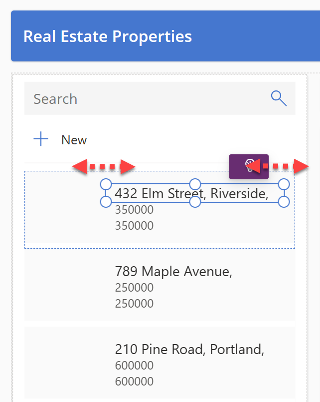
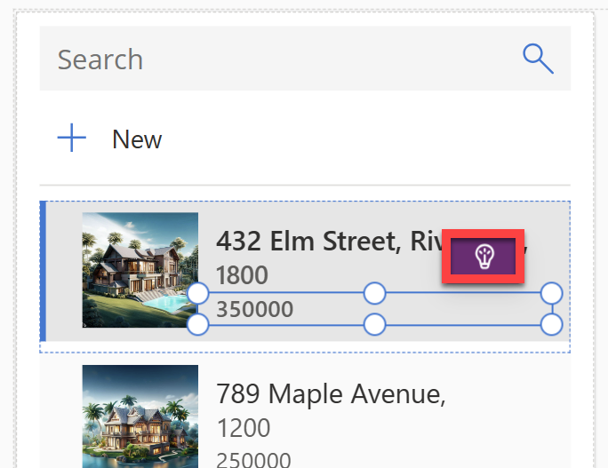
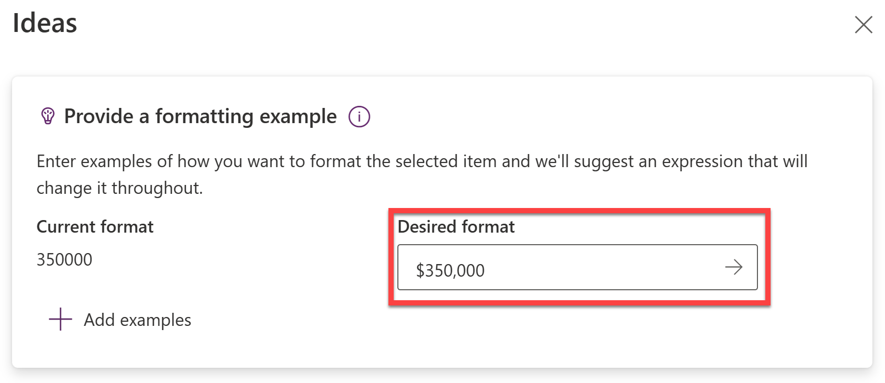

# 🚀 Lab 2: Develop

> [!IMPORTANT]
> This workshop is still work in progress for the time being.

This lab consists of two parts:

- Lab 2A: Develop a Power App
- Lab 2B: Connect your own WebAPI to your Power App

## 🚀 Lab 2A: Develop a Power App

### 📝 Lab 2A - Tasks

In this lab, you will go though the following tasks:

- Creating a Canvas App with Power Apps Copilot
- Creating a solution
- Add the resources created by Power Apps Copilot to a solution

### ☑️ Task 1: Create a Canvas App with Power Apps Copilot

In this task, you’ll create a mobile application leveraging Power Apps Copilot.  This app will be used by field agents to browse real estate inventory and manage appointments for showings and the data will be stored in Dataverse.

Before you begin, watch this video for a brief overview of what to expect when creating your first Power App with Copilot.

> [!NOTE]
> Power Apps requires either a Microsoft 365 license or a free trial. Learn more about your licensing options. [Microsoft products include Microsoft Power Apps and Power Automate](https://learn.microsoft.com/power-apps/administrator/pricing-billing-skus/).

#### EXPLORE AI COPILOT WITHIN POWER APPS

> [!NOTE]
> Within this lab, notice that your results for data may vary from those within the screenshots and images throughout the lab. This is because Power Apps is using OpenAI to generate data for the lab that changes daily.

1. In the center of the **Home** page within Power Apps, there's a text field in which you can enter a prompt to search for an AI generated table.  
  
1. Within the **text field** type the following prompt:
  
    ```text
    build an app to manage real estate showings
    ```

1. Then, select the **Send** button.

      

1. After the AI Copilot generates a table based on your prompt, look through the table to see what columns have been created for the start of your table.

    

    > [!NOTE]
    > If you'd like, you can add or modify the existing columns generated within the table by Copilot. But note that there is a pre-built Suggestions section to the left of the screen.

1. Let's explore further within modifying and adding to the already generated table.
1. In the text box, at the bottom of the **Copilot** pane to the right of the screen, type:

    ```text
    Add a column to track client email
    ```

1. Then, select the **Send** button.

    

1. Notice how a new column has been added to the table displaying the client’s email

    > [!NOTE]
    > Remember that the data that is generated in your table may vary from the data shown within the table in the screenshots and images for the lab.

    > [!NOTE]
    > In the bottom left corner of the screen, notice that there is a section titled Suggestions. This section provides you with different suggestions on how you can add to and modify your table.

    

1. Notice that to the right of the screen, it appears to look as if you're having a conversation with a Copilot AI bot while adding to and modifying your table. Here's where you can scroll through and view the changes or additions you have made to your table.

    

1. Now, let’s edit the **Status** column within the table. In the text box within the **Copilot** pane, type and send:

    ```text
    Add an option for “Completed” to the Status column
    ```

1. It may take a minute to load. Once it does, notice that the column name has been changed.

    

1. Select the **Status** column name **drop down**, and select **View column**. Here, you can view the columns’ properties and the current status details and data.

    

1. Select the **X** in the top right corner of the pane to close out.

    Let's try adding more data to our table and the existing columns.

1. Within the **Copilot** pane text box, type and send:

    ```text
    Add 5 more rows of data
    ```

1. Notice that five more rows of data are added for each of the existing columns within the table.

    

    Let's create the app now.

1. In the bottom right corner of the screen, select the Create app button.

    

1. When the app first loads, a dialog may appear saying: Welcome to Power Apps Studio. If so, select the Skip button.

1. You should now be viewing the app that has been built for you in Edit mode.

    

1. To the left of the screen, select the Data icon from the navigation bar. Notice that a Dataverse table has been created by the Copilot and is now in the Environments section.

    

    > [!NOTE]
    > Copilot is currently only supported for Dataverse. You cannot use any other data access point at this time.

1. Let's try editing the table now that the app has been made.

1. Within the Data pane, hover over the table. To the right of the table, select the ellipsis (...).

1. From the menu, select Edit data.

    

1. The Edit Table dialog appears. Here's where you can come and add your own columns to the table, or modify existing columns.

    

1. Select the ID column header from the table.

1. From the drop-down, select the Edit column option.

    

    In this example, we don't want the Data Type of the column to be a Single line of text. Let's change that.

1. Within the Edit column pane, from the Date type drop-down select # Autonumber

1. Select Save.

    

1. Select the Close button in the bottom right corner of the Edit table dialog.

1. Notice that the table now says Refreshed within the Data pane.

    

1. Now, let's make and add a new request to the table within the app.

1. From the top of the screen, select the Play button.

    

1. Within the pane to the left of the app, select the +New button.

    

1. Although you could modify the form to autofill the fields for you, we're going to do so ourselves to show that the app works.

1. Fill in the following fields with the information below:

1. Agent: `<Your name>`

1. Client: `<Your name>`

1. Client Email: `<Your name>`

1. Property: `<Any address>`

1. Showing Time: `<Any date>`

1. Status: `<Pending>`

1. Then, select the checkmark.

1. Now, select the X in the top right corner to close out of the app.

1. If a dialog appears saying: Did you know?, select OK.

1. Notice that the new request has been added to the list of requests to the left of the app.

1. From the top of your screen, select the Save button to save the new app you have created.

    

Congratulations! You have now created a Power Apps Canvas App with Copilot!

### ☑️ Task 2: Create a solution

TODO: Create a solution called "MPPC23".
TODO: Create another solution called "MPPC23 - Custom Connector"

### ☑️ Task 3: Add the resources created by Power Apps Copilot to a solution

TODO: Add the resources to the "MPPC23" solution.

## 🚀 Lab 2B: Connect your own WebAPI to your Power App

### 📝 Lab 2B - Tasks

In this lab, you will go though the following tasks:

- Open a local Web API in Visual Studio
- Add Connected Service for Power Platform
- Use the Connected Service for Power Platform to debug the connector
- Deploy the connector to Power Platform through Visual Studio
- Add connector to Copilot app created in Lab 02A
- Edit the Copilot created Power App and add the connector to it
- Test the app
- Remove the connector when done with testing
- Deploy the WebAPI to Azure
- Deploy the API to API Management
- Export the API to your Power Platform developer environment via API Management
- Edit the Copilot-created Power App again and add the connector exported from API Management to it
- Add the connector exported from API Management to the "MPPC23 - Custom Connector" solution

### ☑️ Task 1: Open a local Web API in Visual Studio

### ☑️ Task 2: Add Connected Service for Power Platform

### ☑️ Task 3: Use the Connected Service for Power Platform to debug the connector

### ☑️ Task 4: Deploy the connector to Power Platform through Visual Studio

### ☑️ Task 5: Add connector to Copilot app created in Lab 2A

### ☑️ Task 6: Edit the Copilot created Power App and add the connector to it

### ☑️ Task 7: Test the app

### ☑️ Task 8: Remove the connector when done with testing

### ☑️ Task 9: Deploy the WebAPI to Azure

### ☑️ Task 10: Deploy the API to API Management

### ☑️ Task 11: Export the API to your Power Platform developer environment via API Management

### ☑️ Task 12: Edit the Copilot-created Power App again and add the connector exported from API Management to it

### ☑️ Task 13: Add the connector exported from API Management to the "MPPC23 - Custom Connector" solution

## Next lab

This is the end of lab 2, select the link below to move to the next lab.

[⏭️ Move to lab 3](../lab3/README.md)