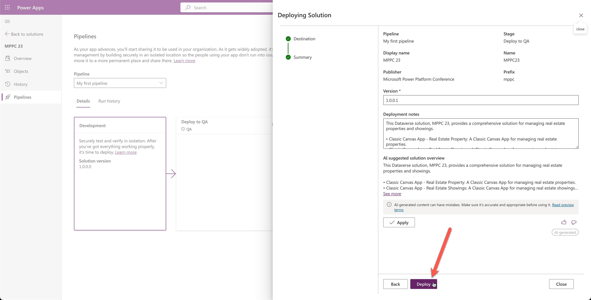
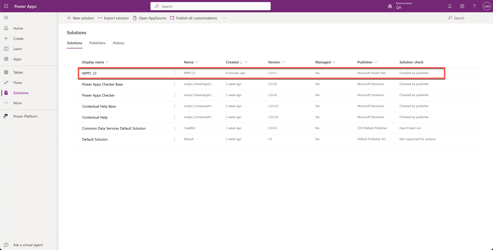
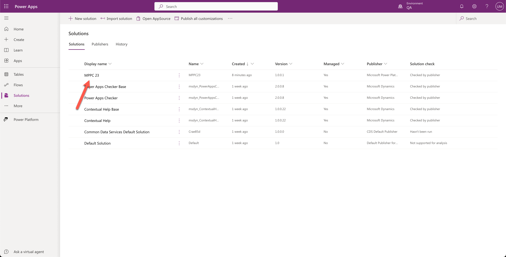

# 🚀 Lab 3: Deploy

## Lab 3 - Tasks

In this lab, you will go though the following tasks:

- Create your first pipeline
- Run the deployment to the QA environment

## Task 1: Create your first pipeline

In this task, you will create your first pipeline. The `Deployment Pipeline Configuration` app that you installed in lab 1 will be used for that.

1. Go to the [maker portal](https://make.powerapps.com), and make sure you are in the `Prod` environment.

    .png)

2. Select the **Deployment Pipeline Configuration (1)** app and click on **Play (2)**.

    (1).png)

3. The app will open in a new tab:

    .png)

    Explore the app to get familiar with the available menu items.

    - To begin with, you'll land on the `Overview` section when you open the app. This serves as the `Pipelines Dashboard`, displaying the latest updates on active runs and pipelines. Don’t worry if it appears empty at first — that’s expected.

    - Next, the `Pipeline Setup` section allows you to view your configured environments and pipelines.

    - The `Deployments` section provides access to the run history and the corresponding solution artifacts.

    - Finally, there's a `Settings` section, where you can manage security teams, configure advanced settings, and customize various aspects of the app.

### Task 1.1 : Create a New Pipeline

1. To create a new pipeline, click on **⋮ (1)** in the `Pipelines Dashboard` and select **+ New (2)**.

    .png)

2. A side panel titled **Quick Create: Deployment Pipeline** will appear.

    - Set the Name to **My first pipeline** **(1)**.

    - Keep the remaining settings as they are and click **Save and Close (2)** to save the pipeline.

        (1).png)

3. You’ll be redirected to the `Pipelines Dashboard`, where **My first pipeline** will now be listed.

4. Select **My first pipeline**.

    (1).png)

5. You’ll be taken to a form where, under the General tab you can enter the details for your pipeline.

    .png)

6. As you scroll down, you’ll notice the following content beneath:

    .png)

    As you can see there are two sections: **Linked Development Environments** & **Deployment Stages**.

    **Linked Development Environments**

    A pipeline can be connected to multiple development environments. This is especially useful when you work with several development setups while sharing the same test and production environments.

    In this lab, we’ll link only one development environment. However, keep in mind that in a real-world company setting, you can associate more than one environment here..

    **Deployment Stages**

    The Deployment Stages section allows you to add stages that follow your development environment. For example, in today’s lab, we’ll be adding a stage called `Deploy to QA`, followed by another called `Deploy to Prod`. What’s great is that you can define the order by setting preceding stages—this ensures that `Deploy to QA` runs before `Deploy to Prod`.

### Task 1.2 : Create a development environment

1. Let’s move forward with the lab by adding a new development environment. To do this, click the **New Development Environment (1)** button located in the Linked Development Environments section.

    .png)

2. A sidebar will appear, allowing you to enter the details of the `Dev` environment created in Lab 01.

    - Set Name as **Dev** **(1)**.

    - Click on the drop-down button and choose the Environment Type as **Development Environment** **(2)** .

        .png)

3. For the next step, make sure to grab the `Environment Id` from the Power Platform Admin Center

    - Open a new tab and go to the [Power Platform Admin Center](https://aka.ms/ppac)

        .png)

    - Select **Manage (1)** from the menu on the left, then click on **Environments (2)** and select the Environment named **Dev** **(3)**.

        (1).png)

    - Copy the **Environment ID**. 

        (1).png)

4. Paste the Environment ID copied in the above step, in the **EnvironmentId (1)** section of **Quick Create: Deployment Environment** window, then click **Save and Close (2)**.

    (1).png)

5. If all went well, you'll see the following screen. 

    .png)

    >**Note:** *Refresh* the page if you don't see it

### Task 1.3 : Add the first deployment stage

1. Now select the **+ New Deployment Stage** button  to add the first deployment stage.

    .png)

2. This will open a new form, where you can enter details about your first deployment stage.

    - Add Name as **Deploy to QA (1)**.

        (1).png)

        >**Note:** We're leaving the Description and Previous Deployment stage empty, because we don't have a previous deployment stage, since this is our first stage.

1. Click on the input box next to **Target Deployment Environment ID** to bring up a small popup that lets you add a new deployment environment. Select **+ New**.
    
    (1).png)

1. A new sidebar will appear, allowing you to provide information about your QA environment.

    (1).png)

1. In the sidebar, add the following details:

    - Set the Name as **QA (1)**.

    - From the drop-down, select EnvironmentType as **Target Environment (2)**.

        .png)

1. To add the environment ID of the test environment

    - Open a new tab and go to the [Power Platform Admin Center](https://aka.ms/ppac)

        .png)

    - Select **Manage (1)** from the menu on the left, then click on **Environments (2)** and select the Environment named **QA** **(3)**.

        (1).png)

     - Copy the **Environment ID**. 

        (1).png)

1. Paste the Environment ID copied in the above step, in the **EnvironmentId (1)** section of **Quick Create: Deployment Environment** window, then click **Save and Close (2)**.

    (1).png)

1. Select **Save and Close** from the bar on top.
   
    (1).png)

### Task 1.4 : Add the `Deploy to prod` deployment stage

1. Select the **+ New Deployment Stage** button again to add a second deployment stage: 

    .png) 

1. Add the following details: 

    - Set Name as **Deploy to prod**.

    - Leave the **Description** empty.

    - In **Previous Deployment Stage**, search and select for the **Deploy to QA** stage.

        (1).png)

1. Click on the input box next to **Target Deployment Environment ID** to bring up a small popup that lets you add a new deployment environment. Select **+ New**.

    (1).png)

    > **Note:**  
    > There is a setting field called `Pre Deployment Step Required`. We're not using that in this case, but think about what could that be used for. During the workshop, the trainers will show an example of it.

1. A new sidebar will appear, allowing you to provide information about your QA environment.

    (1).png)

1. Add the following details:

    - Set Name as **Prod (1)**.

    - Set the Environment Type to **Target Environment (2)**.

        .png)

1. For the next step, make sure to grab the `Environment Id` from the Power Platform Admin Center

    - Open a new tab and go to the [Power Platform Admin Center](https://aka.ms/ppac)

        .png)

    - Select **Manage (1)** from the menu on the left, then click on **Environments (2)** and select the Environment named **Prod** **(3)**.

        (1).png)

     - Copy the **Environment ID**. 

        (1).png)

1. Paste the Environment ID copied in the above step, in the **EnvironmentId (1)** section of **Quick Create: Deployment Environment** window, then click **Save and Close (2)**.

    (1).png)

1. Select **Save and Close** from the bar on top.
   
    (1).png)

## Task 2: Run the deployment to the QA environment

In this task, you’ll deploy the solution built in Lab 2 to both the QA and Production environments. We’ll begin by deploying it to QA. So far in this lab, you’ve set up a pipeline along with its associated stages. But how exactly does a maker move a solution from the `Dev` environment to the `QA` and `Prod` environments?

1. Go to the [maker portal](https://make.powerapps.com)

1. Make sure to select the **Dev** environment

1. Go to **Solutions** via the left menu

1. Select the **MPPC 23** solution by selecting the display name

    

1. Select the **rocket icon** on the left

    

    This will show you a new screen where you can see an overview of all stages you just configured in the last task

    

1. Select the purple **Deploy here** button. This will open a new sidebar which will give you the option to start your deployment now or plan your deployment for later

    

1. Notice the message at below the deployment schedule. This indicates that this pipeline uses AI to generate a solution overview

    

1. Leave everything on default and select the purple **Next** button on the bottom of the sidebar

    This will lead you to the next section called `Summary`. Here you can find a bunch of info about the solution you are about to deploy to the QA environment. It also shows an AI suggested solution overview

    

    When you're happy with that AI generated solution overview, select the **Apply** button below the AI suggested solution overview

    Now the AI suggested solution overview is added in the `Deployment notes` box

    

1. Check the AI suggested solution overview to make sure it doesn't include any errors and correct where needed

1. Select the purple **Deploy** button

    

It will take a couple of minutes to deploy the solution to the QA environment. After it's done, the overview page for the pipelines should look like this:

As you can see, the last deployed solution version and last deployed date time are visible here.

### Test if the solution was correctly deployed to QA

1. Of course, you want to see for yourself if the deployment was successful, so select the **Go to this environment** button in the `Deploy to QA` stage

    

1. Select **Solutions** in the left navigation

1. Check if the `MPPC 23` solution with version 1.0.0.1 is installed in the `QA` environment

    

1. Open the `MPPC 23`solution by selecting the **display name**

    

1. Select the **Real Estate Property** canvas app and select the **Play** button in the command bar at the top

    

1. This will open the app in a new tab

    

    It will look like your app is broken, since it will have the message `Getting your data`, but it's working fine! The problem is that there is no data in this environment, because we just deployed the solution here. Let's fix that!

1. Select the **+ New** button on the left side of the screen

1. Fill in the following fields with the information below:

    - ID: `101`

    - Image: `https://raw.githubusercontent.com/microsoft/PowerPlatformAdvocates/main/MSLearn/AIModule/Images/property1.jpg`

    - Owner: `Emily Johnson`

    - OwnerEmail: `emily.johnson@example.com`

    - Size: `1800`

    - Address: `432 Elm Street, Riverside, CA 92501`

    - Price: `350000`

1. Select the **check** to save the new row

    

1. Now you will see at least one row in the app and the app should look more familiar with the photo and the Power Apps Ideas formatting we did in lab 2

    

1. Select the **Real Estate Showings** canvas app and select the **Play** button in the command bar at the top

    

1. This will open the app in a new tab

    

    Again, it will look like your app is broken, since it will have the message `Getting your data`, but it's working fine!

1. Select the **+ New** button on the left side of the screen

1. Fill in the following fields with the information below:

    - Agent: `James Bond`

    - Client Email: `austin@example.com`

    - Client Name: `Austin Powers`

    - Showing Date: `<Pick the date of today - don't change the time>`

    - Showing Time: `<Pick the date of today - change the time to 10:00>`

    - Status: `Pending`

    - Property: `432 Elm Street, Riverside, CA 92501`

1. Select the **check** to save the new row

    

1. Now you will see at least one row in the app and the app should look more familiar like the `Real Estate Showings` app we created in lab 2

    

Now you know the app works in QA, let's deploy it to production.

## Next lab

This is the end of lab 3. Select page 4 below to move to the next lab.
