# 🚀 Lab 4: Enterprise Scale

## Lab 4 - Tasks

In this lab, you will go through only one task:

- Extend the previous pipeline with Approvals

## ☑️ Task: Extend the previous pipeline with Approvals

### Task 1.1 : Extending the pipeline in the Deployment Pipeline Configuration App

In this task, you will learn how to extend the pipeline and add an approval before deploying to production.

1. Go to the [maker portal](https://make.powerapps.com)

2. Make sure you're in the **Prod** environment; if you're not, switch to it.

    

3. Hover on the **Deployment Pipeline Configuration** app, and select the **Play** button.

    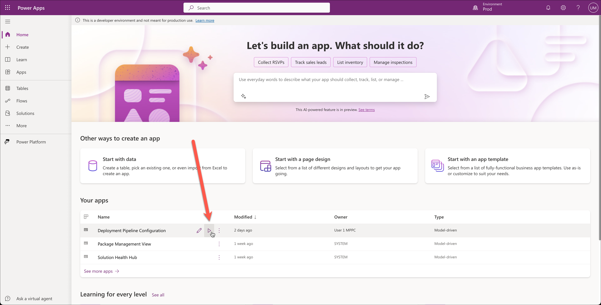

4. This will open the **Deployment Pipeline Configuration** app and will enable you to modify your pipeline. Select the **My first pipeline** pipeline.

    .png)

5. On the next screen, scroll down to the **Deployment Stages** and select the **Deploy to prod** deployment stage.

    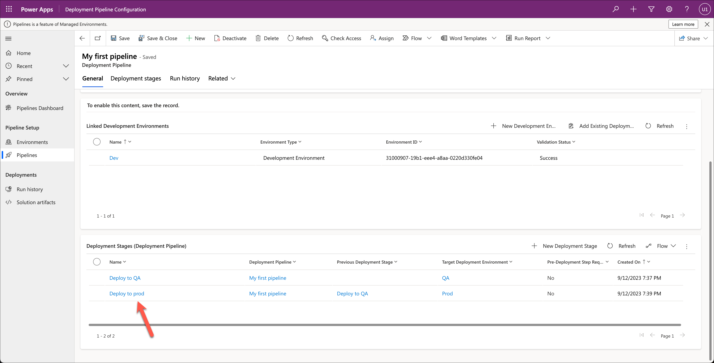

6. Enable the check box in the **Pre-Deployment Step Required (1)** field and select the **Save & Close (2)** button in the command bar at the top.

    .png)

7. In the Deployment Stages subgrid, verify whether the **Pre-Deployment Step Required field** is set to **Yes**. If it is, the task is complete. If not, return to step 5 and try again.

    .png)

### Task 1.2 : Create a cloud flow that handles the approval

In this task, you will learn how to create an approval flow that will handle the approval before deploying to production.

1. Go to the [maker portal](https://make.powerapps.com).

2. Check if you are in the **Prod** environment and if not, switch to that environment.

    

3. Select **Flows (1)** from the left navigation pane, the select **New flow (2)** in the command bar at the top and select **Automated cloud flow (3)**.

    .png)

4. This will open a pop up where you can name your flow and configure a trigger. 

    - Name your flow as **My first pipeline production approval (1)**, 
    - Search for **action (2)**,
    - Select the Microsoft Dataverse trigger  **When an action is performed (3)** and
    - Select the **Create (4)** button.  

        .png)

5. Configure the trigger inputs by making it look like the screenshot below.

    .png)

    >**Note:** If a small Microsoft Dataverse dialog appears, choose **OAuth** as the Authentication Type and sign in using the same credentials you used for Power Apps. 

6. Select the **ellipsis (...) (1)** at the top-right corner of the trigger and select **Settings (2)** to open up the trigger settings.

    .png)

7. Select the **Add** button below trigger conditions to add a trigger condition.

    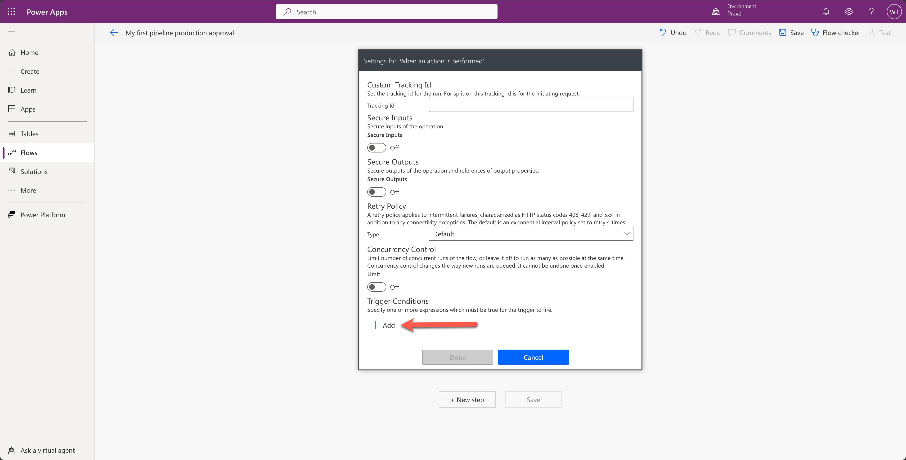

8. Add the following trigger condition to make sure the cloud flow only triggers when the pipeline name is equal to **My first pipeline**.

    ```
    @equals(triggerOutputs()?['body/OutputParameters/DeploymentPipelineName'], 'My first pipeline')
    ```

9. Select the **Add** button below the trigger condition above to add another trigger condition.    

    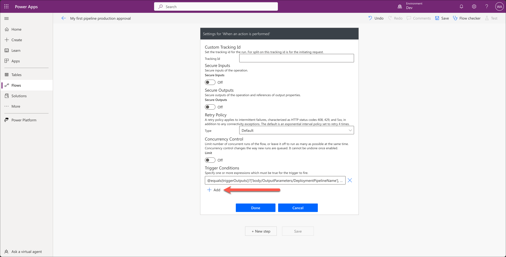

10. Add the following trigger condition to make sure the cloud flow only triggers when the pipeline name is equal to **Deploy to prod**.

    ```
    @equals(triggerOutputs()?['body/OutputParameters/DeploymentStageName'], 'Deploy to prod')
    ```

11. Select the **Done** button at the bottom of the trigger card to save the trigger conditions.

    .png)

12. Select the **New step** button to add an action to start and wait for an approval.

    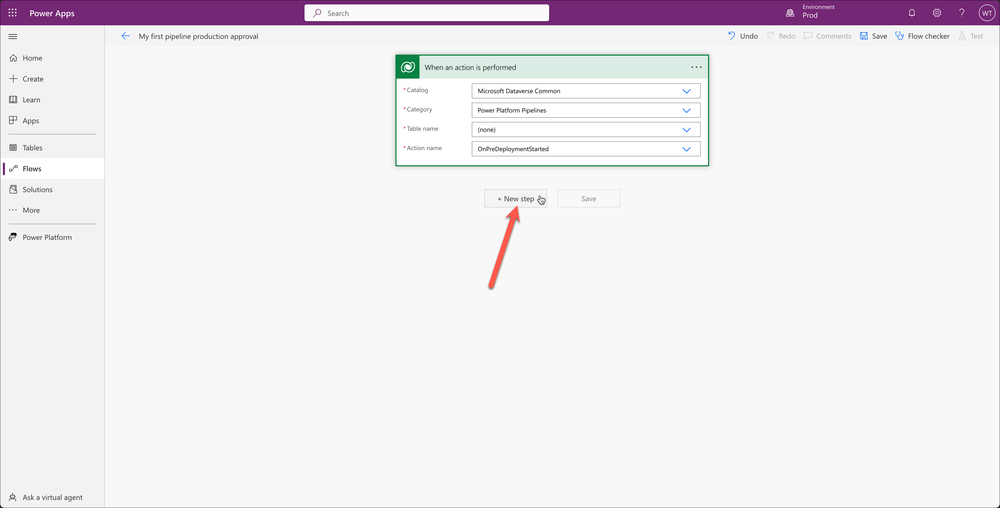

13. Search for **approval (1)** and select the **Start and wait for an approval (2)** action.

    .png)

14. Configure the approval action as:  

    - In **Approval Type**, select **Approve/Reject - First to respond**.  

    - For title, add **Approval requested for**, select **ActionOutputs DeploymentPipelineName** from the dynamic content fields on the right, add ` - `, and select another dynamic content field from the right called **ActionOutputs DeploymentStageName**.  

    - For **Assigned to**, add the **email address of your user**.
        >**Note:** In production scenarios, this would be an admin that would approve deployments.  

    - For **Details**, add **# Deployment notes**, add a hard return, and select the **ActionOutputs DeploymentNotes** field from the dynamic content fields on the right.  

    - For item link, select the **ActionOutputs StageRunDetailsLink** field from the dynamic content fields on the right.  

    - For item link description, add **Stage Run Details**.  

        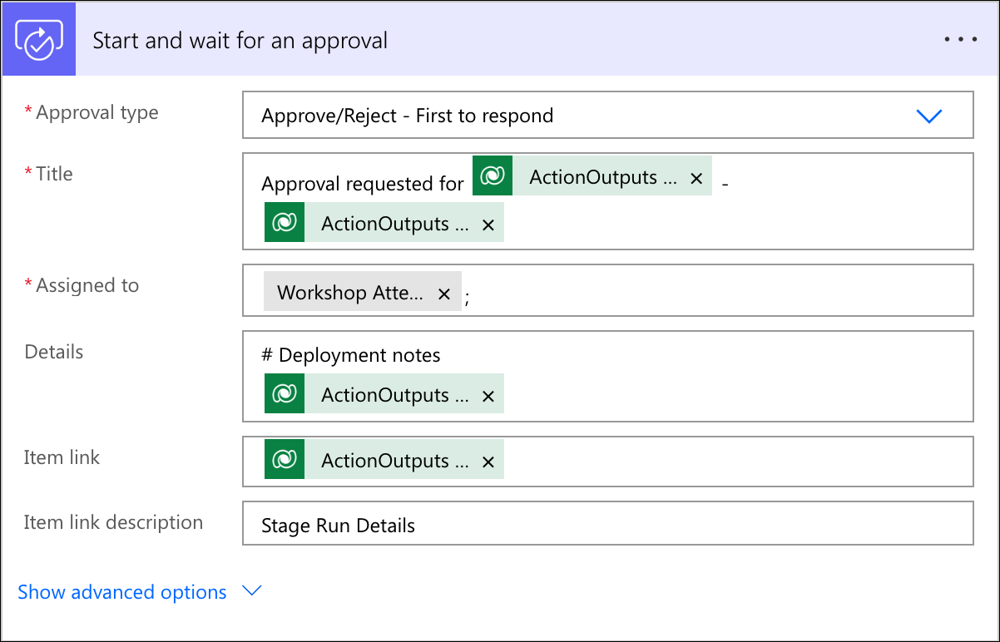

15. Click the **New step** button to insert a condition beneath the **Start and wait for an approval** action.

    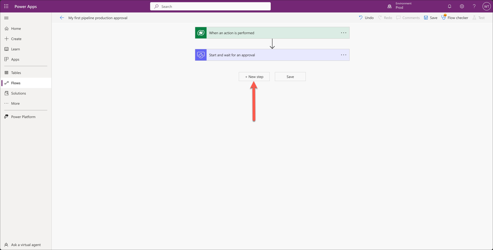

16. Add the **Condition** action.

    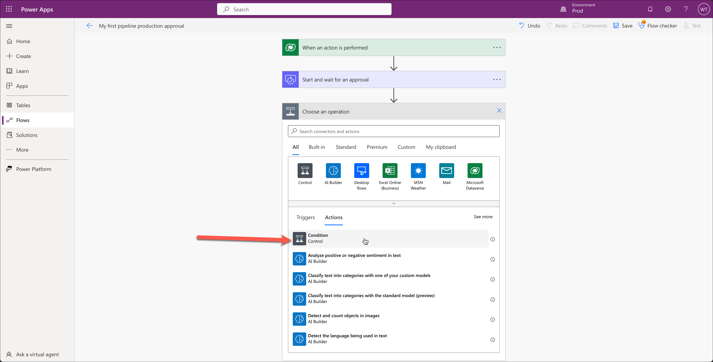

17. In the first input field of the condition:

    - Click inside it. In the dynamic content panel, select ***Outcome** under Start and wait for an approval.

18. Add the text **Approve** to the other input field of the condition.

    (1).png)

19. In the **If yes** section of the condition,

    - Click **Add an action**.

    - Search for and select:**Perform an unbound action** (from the Microsoft Dataverse connector).

20. Now configure the action fields:

    - Action Name: Select or type **UpdatePreDeploymentStepStatus**.  

    - Add **20** as the PreDeploymentStepStatus (20 is the status ID for approved).  

    - Add the **Response summary** dynamic content field from the **Start and wait for an approval** action as Comments.  

    - Add the following expression via the expression panel to the **Comments** field and select the **OK** button:

        ```
        first(outputs('Start_and_wait_for_an_approval')?['body/responses'])?['comments']
        ```  

        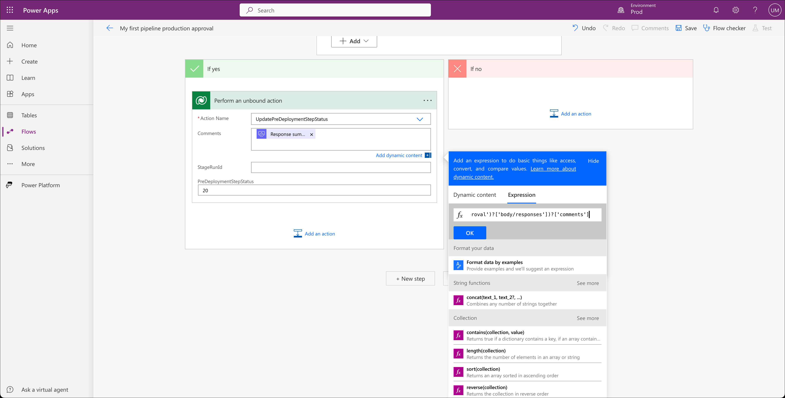

21. Add the **ActionInputs StageRunId** dynamic content field from the **When an action is performed** trigger as StageRunId.  

22. In the **If no** section of the condition,

    - Click **Add an action**.

    - Search for and select:**Perform an unbound action** (from the Microsoft Dataverse connector).

23. Now configure the action fields: 
    
    - Action Name: Select or type **UpdatePreDeploymentStepStatus**.

    - Add **30** as the **PreDeploymentStepStatus** (30 is the status ID for rejected).  

    - Add the **Response summary** dynamic content field from the **Start and wait for an approval** action as Comments.  

    - Add the following expression via the expression panel to the **Comments** field and select the blue **OK** button:

        ```
        first(outputs('Start_and_wait_for_an_approval')?['body/responses'])?['comments']
        ```

          

24. Add the **ActionInputs StageRunId** dynamic content field from the **When an action is performed** trigger as StageRunId.  

    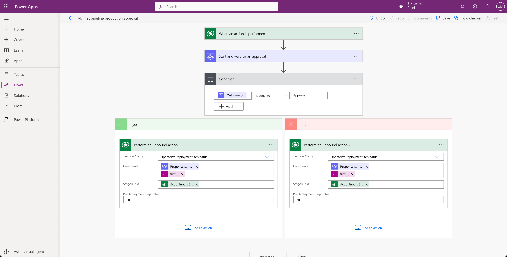

23. Click on **Save** to save the flow.

### Task 1.3 : Test and Execute "Deploy to Prod" with Approval Process

In this task, you are going to find out if the approval you configured in the last task actually works!

1. Go to the [maker portal](https://make.powerapps.com).

1. Ensure you're in the **Dev** environment; if you're not, switch to it.

    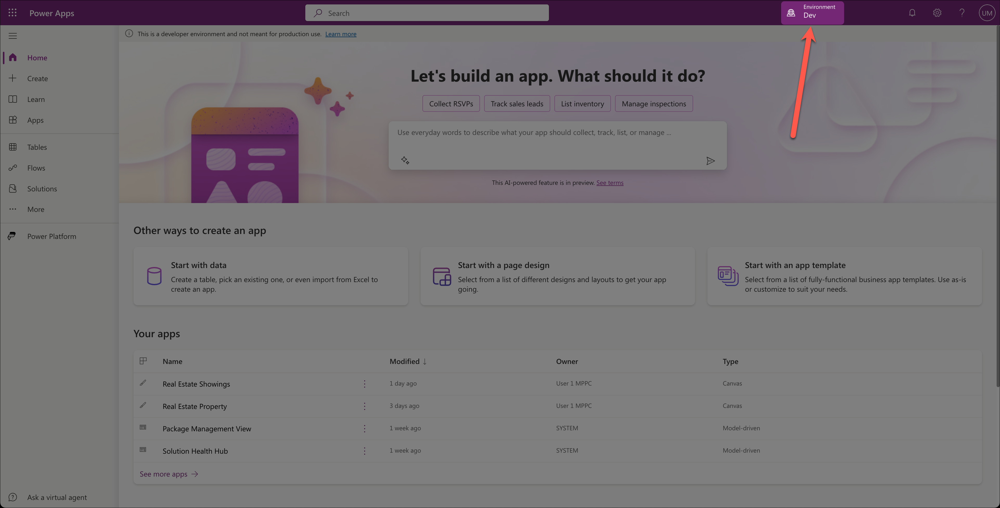

1. Go to **Solutions (1)** in the left menu. Select the **MPPC 23 (2)** solution.

    .png)

1. Select the **Pipelines** from the left.

    .png)

1. Earlier in this lab, you have made a Pre-Deployment Step required. That means that now, there is an info box on the deploy to prod stage.

    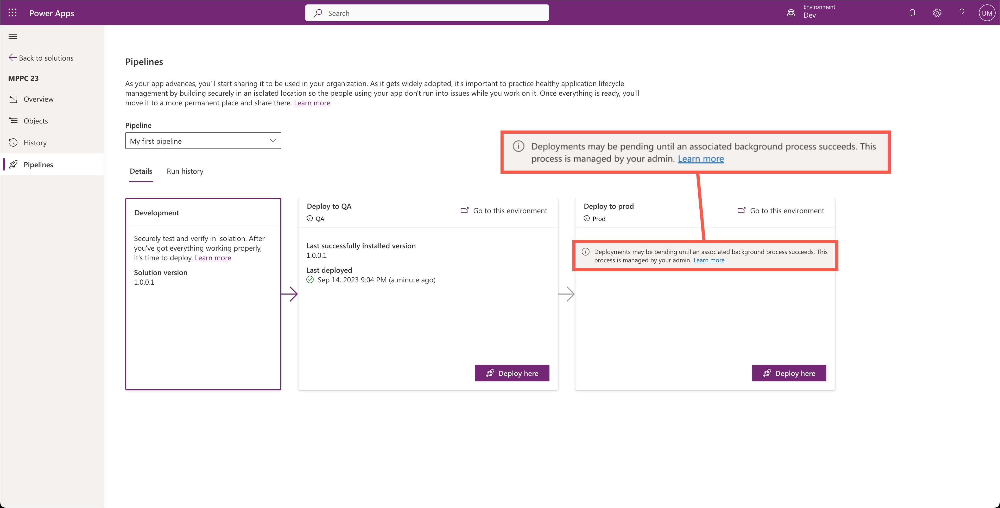

1. Select the purple **Deploy here** button.

    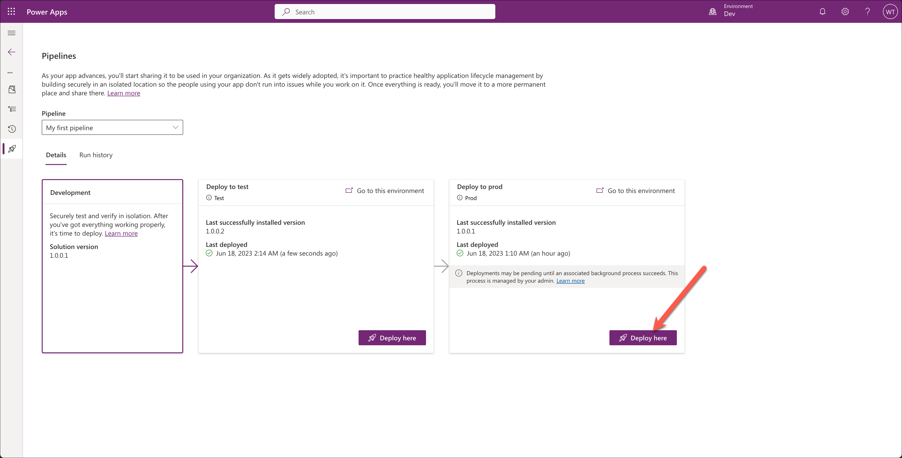  

1. This will open a new sidebar which will give you the option to start your deployment now or plan your deployment for later. Select the purple **Next** button to go to the next screen.

    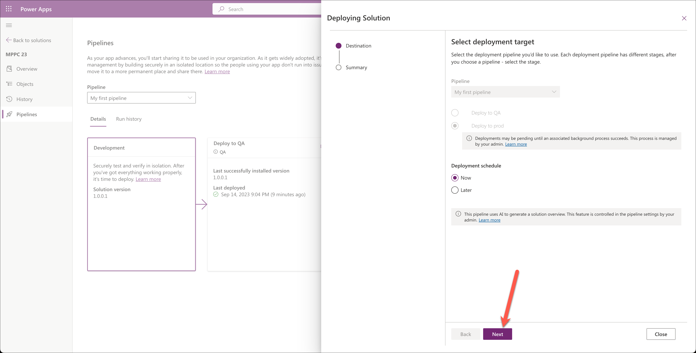  

1. Leave everything as default and select the **Next** button.

    >This will lead you to the next section called **Summary**. Here you can find a bunch of info about the solution you are about to deploy to the QA environment. It also shows an AI suggested solution overview.

    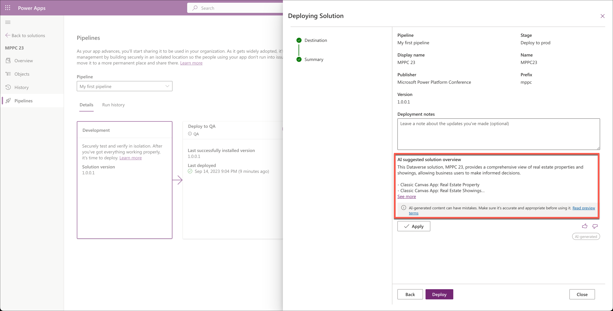

1. When you're happy with that AI generated solution overview, select the **Apply** button below the AI suggested solution overview.
Now the AI suggested solution overview is added in the **Deployment notes** box.

    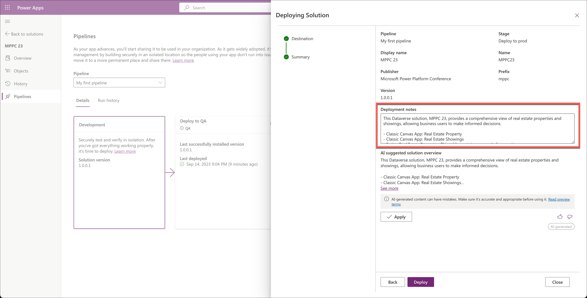

1. Review the AI-suggested solution overview to ensure it's free of errors, and make corrections if necessary.

1. Select the **Deploy** button.

1. Next, you will see the following screen, that shows a yellow box which states that **Your request to deploy here is pending**.

    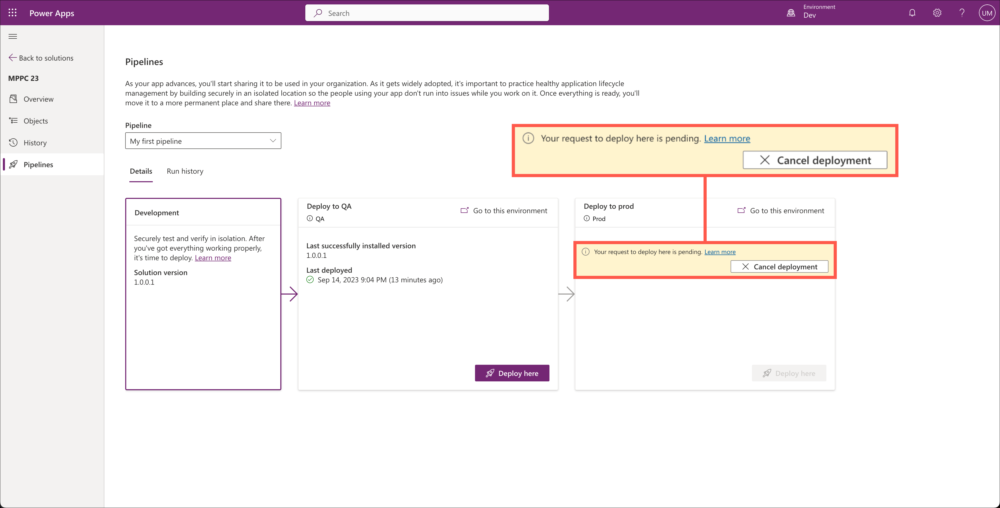

1. This message is showing because our changes in the beginning of the lab made sure that the Power Automate cloud flow is now triggered. We are working on a fresh environment, so it can take a while before the approval solution is deployed. Best is to take a break now, since it can take 5-10 minutes before your next step.

1. Open a new browser tab and go to [Outlook web](https://outlook.office.com) and wait for the approval email. After 5-10 minutes (only the first time!) it should arrive.

1. In the approval mail you will see a couple of familiar parts:  

    - You will see the title of the **Approval (1)**.  

    - You will see the **Deployment notes (2)**.  

    - You will see **Approve / Reject buttons (3)**.  

    - You will be able to add **Comments (4)**.  

    - You will be able to **Submit (5)** the approval / rejection.  

1. Make sure to select **Approve** in the approval email, add **Approved!** as comments and select the **Submit** button.

    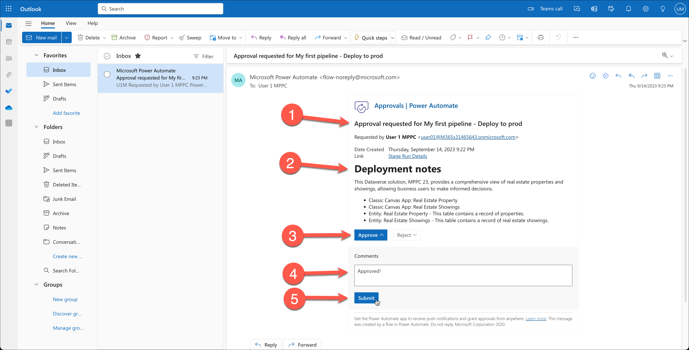  

1. Close the Outlook browser tab, and you will see (sometimes you have to refresh) that the deployment to production is in progress.

    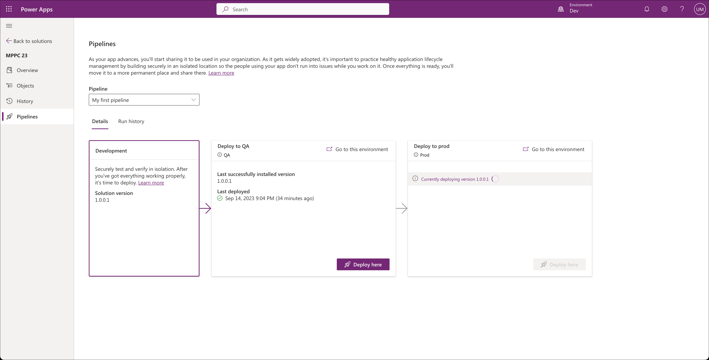

1. After the deployment is finished, you will see that the deployment is finished.

    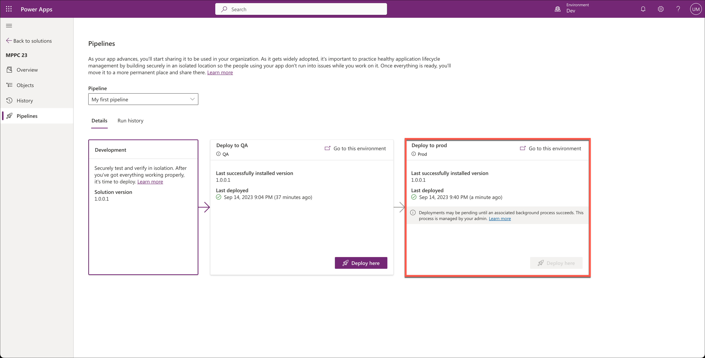

And that's how the deployment with approvals works!

### Solution Checker Warning

In the meantime, you should've gotten another email.

1. Go to [Outlook web](https://outlook.office.com)

1. Look for an email with the subject **Solution checked for issues during import**.

    It should look something like this:

    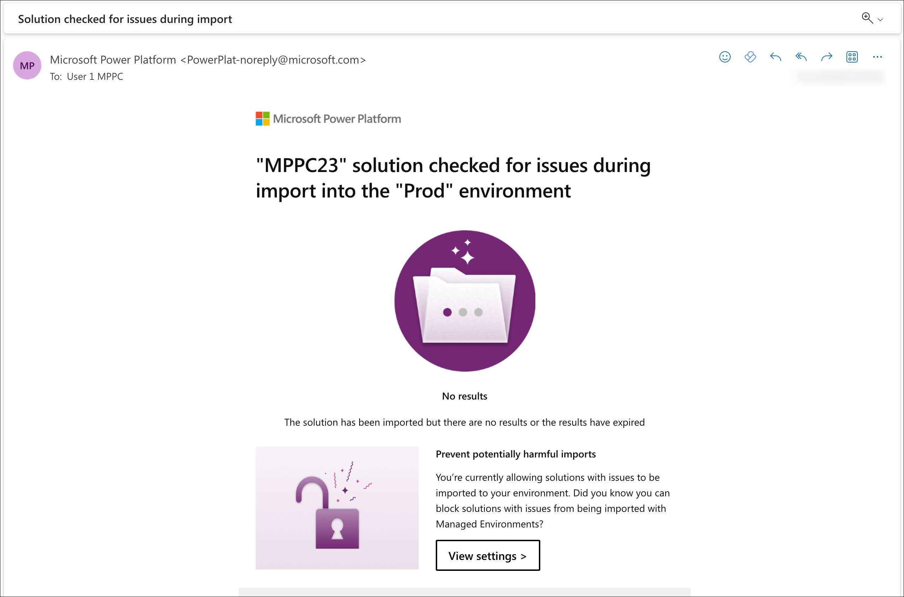

    This email shows there are no solution checker issues found in our solution we just deployed to production: well done!

## End of labs

This is the end of lab 4. Select page 5 below to move to the next lab.
