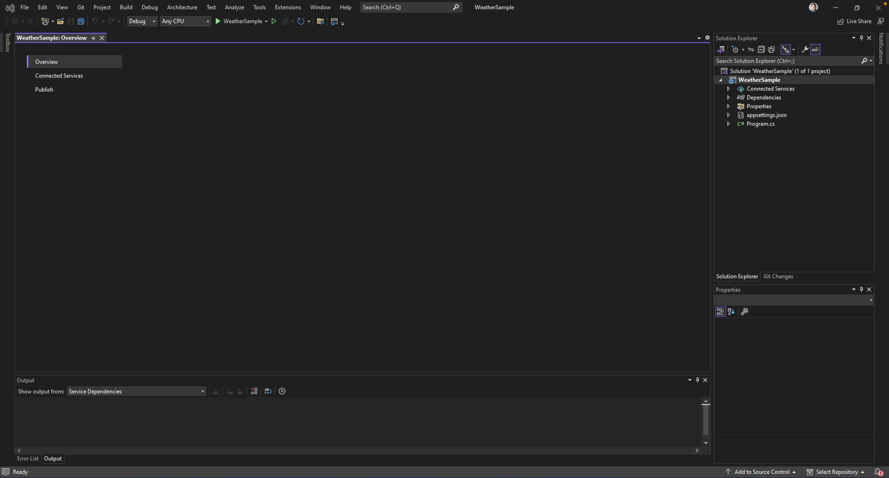

# 🚀 Lab 5: Connect your own WebAPI to your Power App

> [!IMPORTANT]
> This workshop is still work in progress for the time being.

> [!IMPORTANT]
> This lab is optional. Only do this one when you are finished with lab 1 - lab 4.

## 📝 Lab 5 - Tasks

In this lab, you will go though the following tasks:

- Create a local Web API in Visual Studio
- Add Connected Service for Power Platform
- Use the Connected Service for Power Platform to debug the connector
- Deploy the connector to Power Platform through Visual Studio
- Create a Canvas App
- Add the connector to the Canvas App
- Test the app

## ☑️ Task 1: Create a Web API in Visual Studio

In this task, we will create an ASP.NET project in Visual Studio.

1. Open Visual Studio 2022

1. Select **Create a new project**

    

1. Search for `ASP.NET Core Web API`, select the one that has C# in the tags and select **Next**

1. Enter the following details and select **Next**:

    Enter `WeatherSample` for the Project name

    Enter `C:\Dev` for the Location

1. In the next screen, select **Create**

This should create your ASP.NET Code Web API project and open it in Visual Studio 2022.

## ☑️ Task 2: Add Connected Service for Power Platform

In this task, you will add the Connected Service for Power Platform to your ASP.NET Code Web API project.

In the screen in Visual Studio where we left off at the end of task one, on the right, you can find the `Solution Explorer`

1. Right click Connected Services (1), select Add (2) & select Microsoft Power Platform (3)

    

1. Select the **dropdown** and select the **Microsoft option** below `Add an account`

    

1. Sign into your account

    

## ☑️ Task 3: Use the Connected Service for Power Platform to debug the connector

## ☑️ Task 4: Deploy the connector to Power Platform through Visual Studio

## ☑️ Task 5: Create a Canvas App

## ☑️ Task 6: Add the connector to the Canvas App

## ☑️ Task 7: Test the app

## End of labs

This is the end of the optional lab 5 and the workshop, select the link below to move back to the workshop readme.

[⏭️ Move to the workshop readme](../README.md)
